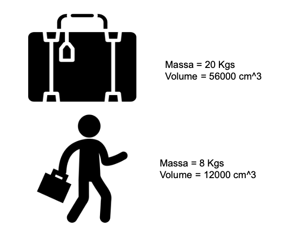
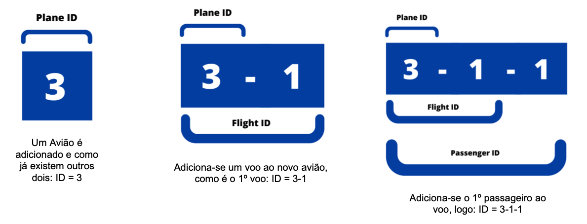

### Project 1 - Airline Database Management, AirED (Grade: 18.6 / 20)

A project done in one month with [Carolina Brandão](https://github.com/CarolBrandak) and [Gabriel Machado Jr.](https://github.com/gabrieltmjr).  
It is intended to implement an information management system that must store and manage information related to planes, flights, passengers and luggage.

Implemented features:
- [x] Simpler and non-recursive interface, based on the Stack data structure;

 

  

Menu strategy. Image credits: Gabriel Machado Jr.

 

- [x] Efficient search to the nearest transport, using Binary Search Tree data structure;
- [x] Efficient search to flights, planes, services, luggage using linear-search in lists and binary-search in sorted vectors;
- [x] Two types of luggage: hand-luggage and hold-luggage, depends on the user input and volume/weight proprieties;

 

  

Luggage strategy. Image credits: Carolina Brandão

 

- [x] Automatic compound unique IDs, to better performance and avoid collisions in system population and manipulation;

 

  

IDs strategy. Image credits: Gabriel Machado Jr.

 

- [x] Secure Data: files have the ability to self-heal if there is data corruption during the execution of program, using redundancy based on [RAID](https://pt.wikipedia.org/wiki/RAID);
- [x] [ON DELETE CASCADE](https://www.mysqltutorial.org/mysql-on-delete-cascade/) implicit behavior, activation whenever delete certain component, based on SQL databases management systems (DBMS);

 