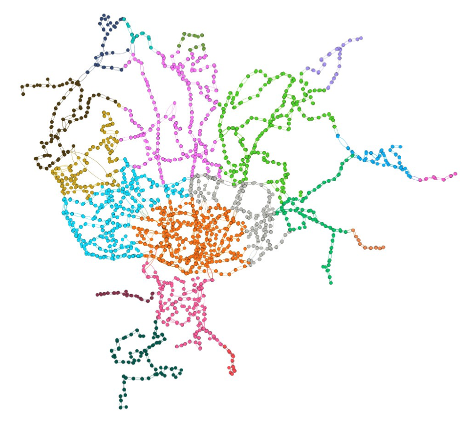
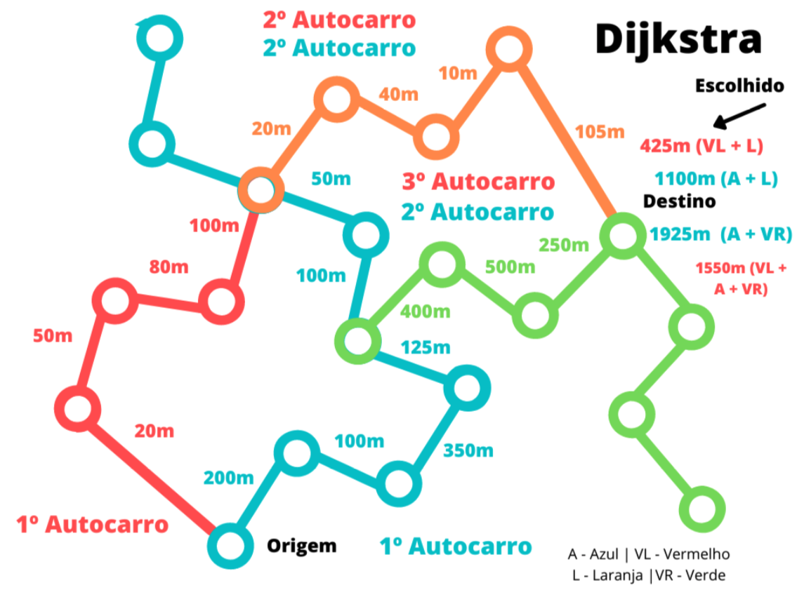

### Project 2 - STCP++ (Grade: 19.73 / 20)

A project done in two weeks with [Carolina Brandão](https://github.com/CarolBrandak) and [Gabriel Machado Jr.](https://github.com/gabrieltmjr).  
The “Sociedade de Transportes Colectivos do Porto (STCP)” is the company that manages the bus network in the municipality of Porto (and also in some neighboring areas). It is intended to implement a system capable of providing help to those who want to use the STCP network to move around, such as a Google Maps, through Algorithms that manipulate Graphs.  
All data, coordinates, lines and stops used are real and were provided by Professor [Pedro Ribeiro](https://www.dcc.fc.up.pt/~pribeiro/).

  

There are 2487 different bus stops in Porto. Image credits: Pedro Ribeiro.

 

Implemented features:

- [x] Search the nearest stop by name, code and coordinates (latitude and longitude);
- [x] [Beadth-First Search](https://pt.wikipedia.org/wiki/Busca_em_largura), to find the shorter path between origin/destiny stops, based on the fewest stops traveled;
- [x] Search the shorter path between origin/destiny stops, based on the total distance traveled using [Dijkstra Algorithm](https://en.wikipedia.org/wiki/Dijkstra's_algorithm) adaptation;
- [x] Search the cheapest way between origin/destiny stops, based on the total zones traveled using Dijkstra too;

  

Dijkstra implementation. Image credits: Gabriel Machado Jr.

 

- [x] Search the most comfortable way between origin/destiny stops, based on the total lines traveled using Dijkstra too;
- [x] Allow the person to decide how far they can walk from one stop or line to another;
- [x] Allow the person to decide which stops, zones, lines or areas they do not want to travel;

 