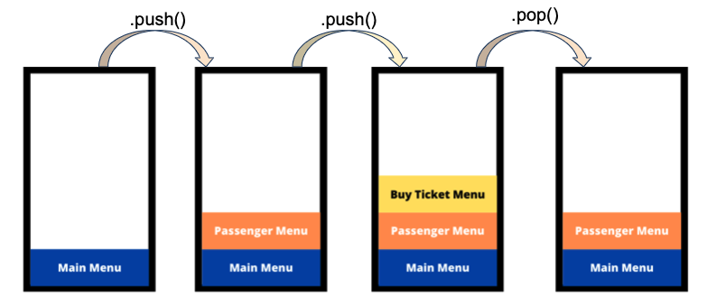
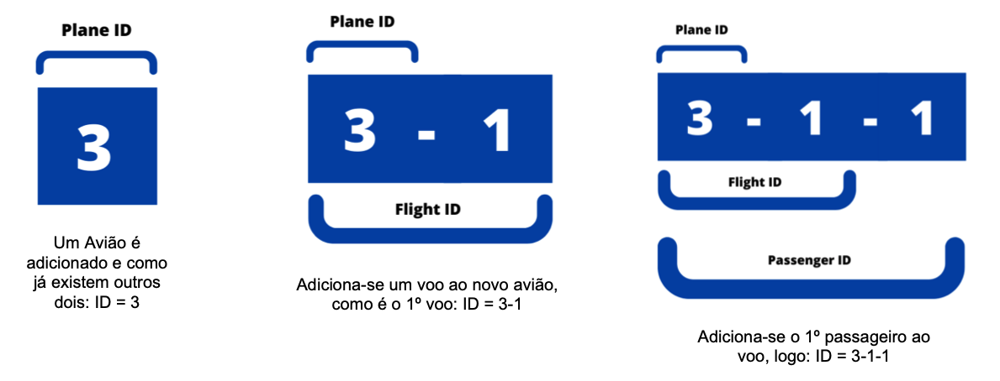

# Algoritmos e Estruturas de Dados (AED) - Year 2, Semester 1 (Y2S1)

This repository contains all the exercises and assessments of the UC Algorithms and Data Structures, taught by [Pedro Ribeiro](https://www.dcc.fc.up.pt/~pribeiro/) and [Ana Paula Rocha](https://sigarra.up.pt/feup/pt/func_geral.formview?p_codigo=211625) at [Integrated Master in Informatics and Computing Engineering](https://sigarra.up.pt/feup/pt/cur_geral.cur_view?pv_curso_id=742) [MIEIC] at the [Faculty of Engineering of the University of Porto](https://sigarra.up.pt/feup/pt/web_page.Inicial) [FEUP].  

 

  

## Here are several documents, namely:

### My Drafts  
Pieces of code for exercises and assessments, notes that I take during practical classes and other experiences using C and C++ languages. It is an authentic disorganized notebook.  

### Notes
Notes that I take during theoretical lectures. 

### Exercises / Mooshak
Varied exercises of easy, medium and difficult level, about the subject taught in the present week. They complement the weekly work developed during the practical classes.  
 

### Project 1 - Airline Database Management, AirED (Grade: 18.6 / 20)

A project done in one month with [Carolina Brandão](https://github.com/CarolBrandak) and [Gabriel Machado Jr.](https://github.com/gabrieltmjr).  
It is intended to implement an information management system that must store and manage information related to planes, flights, passengers and luggage.

Implemented features:
- [x] Simpler and non-recursive interface, based on the Stack data structure;

 

  

Menu strategy. Image credits: Gabriel Machado Jr.

 

- [x] Efficient search to the nearest transport, using Binary Search Tree data structure;
- [x] Efficient search to flights, planes, services, luggage using linear-search in lists and binary-search in sorted vectors;
- [x] Two types of luggage: hand-luggage and hold-luggage, depends on the user input and volume/weight proprieties;

 

  

Luggage strategy. Image credits: Carolina Brandão

 

- [x] Automatic compound unique IDs, to better performance and avoid collisions in system population and manipulation;

 

  

IDs strategy. Image credits: Gabriel Machado Jr.

 

- [x] Secure Data: files have the ability to self-heal if there is data corruption during the execution of program, using redundancy based on [RAID](https://pt.wikipedia.org/wiki/RAID);
- [x] [ON DELETE CASCADE](https://www.mysqltutorial.org/mysql-on-delete-cascade/) implicit behavior, activation whenever delete certain component, based on SQL databases management systems (DBMS);

 

### Project 2 - STCP++ (Grade: 19.73 / 20)

A project done in two weeks with [Carolina Brandão](https://github.com/CarolBrandak) and [Gabriel Machado Jr.](https://github.com/gabrieltmjr).  
The “Sociedade de Transportes Colectivos do Porto (STCP)” is the company that manages the bus network in the municipality of Porto (and also in some neighboring areas). It is intended to implement a system capable of providing help to those who want to use the STCP network to move around, such as a Google Maps, through Algorithms that manipulate Graphs.  
All data, coordinates, lines and stops used are real and were provided by Professor [Pedro Ribeiro](https://www.dcc.fc.up.pt/~pribeiro/).

  

There are 2487 different bus stops in Porto. Image credits: Pedro Ribeiro.

 

Implemented features:

- [x] Search the nearest stop by name, code and coordinates (latitude and longitude);
- [x] [Beadth-First Search](https://pt.wikipedia.org/wiki/Busca_em_largura), to find the shorter path between origin/destiny stops, based on the fewest stops traveled;
- [x] Search the shorter path between origin/destiny stops, based on the total distance traveled using [Dijkstra Algorithm](https://en.wikipedia.org/wiki/Dijkstra's_algorithm) adaptation;
- [x] Search the cheapest way between origin/destiny stops, based on the total zones traveled using Dijkstra too;

  

Dijkstra implementation. Image credits: Gabriel Machado Jr.

 

- [x] Search the most comfortable way between origin/destiny stops, based on the total lines traveled using Dijkstra too;
- [x] Allow the person to decide how far they can walk from one stop or line to another;
- [x] Allow the person to decide which stops, zones, lines or areas they do not want to travel;

 

**@ Fábio Araújo de Sá**  
**2021/2022**
